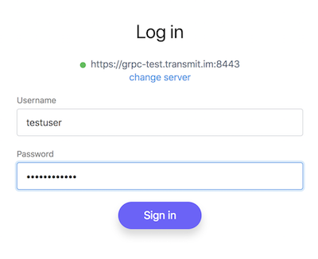
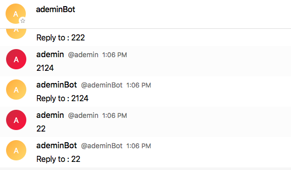
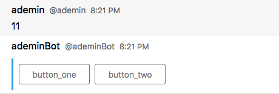
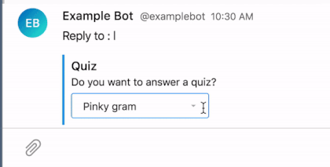
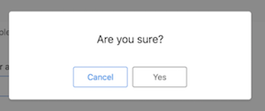
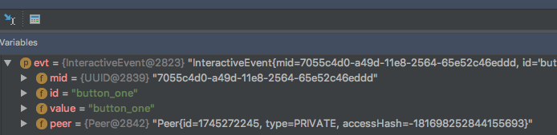
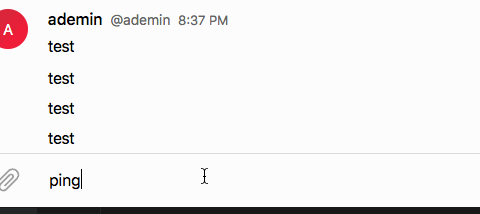

Java Bot SDK
============

Configuring
-----------

Bot is hosted on
`grpc server <https://grpc-test.transmit.im/>`_.

Login information:

  +------------------+----------------------------------------+
  | Endpoint         | ``https://grpc-test.transmit.im:8443`` |
  +------------------+----------------------------------------+
  | Credentials      | *testuser* / *testpassword*            |
  +------------------+----------------------------------------+

Messaging
---------

Starting the bot

.. code-block:: java

  import im.dlg.botsdk.Bot;
  import java.util.concurrent.ExecutionException;
  
  public class Main {
  
      public static void main(String[] args) throws InterruptedException, ExecutionException {
          
          Bot bot = Bot.start("your_bot_token").get();
          
          // Your BOT logic here!
          
          // Await to prevent thread to die
          bot.await();
      }
  }
  

To subscribe on messages call the following api of 'messaging':

.. code-block:: java
  
  ...
  bot.messaging().onMessage(message -> {
      // Handle incoming messages here
  });
  ...

You can send a message to some Peer (that you get from message or saved previously):

.. code-block:: java

  ...
  Peer peer = ...
  CompletableFuture<UUID> future = bot.messaging().send(peer, "My awesome text");
  ...

Api method returns the future and you chain requests or handle errors

.. code-block:: java

  ...
  future.thenAccept(uuid -> {
      // uuid is a message id
  }).exceptionally(ex -> {
      ex.printStackTrace();
      return null;
  });
  ...

Simple ping-pong example:

.. code-block:: java

  bot.messaging().onMessage(message ->
          bot.users().get(message.getSender()).thenAccept(userOpt -> userOpt.ifPresent(user -> {
                      System.out.println("Got a message: " + message.getText() + " from user: " + user.getName());
                  })
          ).thenCompose(aVoid ->
                  bot.messaging().send(message.getPeer(), "Reply to : " + message.getText())
          ).thenAccept(uuid ->
                  System.out.println("Sent a message with UUID: " + uuid)));

Send files
----------

For image sending use method

.. code-block:: java
  
  bot.messaging().onMessage(message ->
           ...
          ).thenCompose(aVoid ->
                  bot.messaging().sendMedia(message.getPeer(), ((TextContent) message.getMessageContent()).getMedias())
          )
  ...

It is implied, that file will be received from server, however it can be passed manually with appropriate file id:

.. code-block:: java
  
  public ArrayList<MessagingOuterClass.MessageMedia> createMedias() {
          long fileId = 1234; // your file id
          long accessHash = 312; // server access hash
          FileLocation fileLocation = new FileLocation(fileId, accessHash);

          int width = 230; // image width
          int height = 230; // image height
          int fileSize =  2345;
          ImageLocation imageLocation = new ImageLocation(fileLocation, width, height, fileSize);
          ImageMedia imageMedia = new ImageMedia(imageLocation);
          MediaMessage mediaMessage = new MediaMessage(imageMedia, null, null, null);
          ArrayList<MessagingOuterClass.MessageMedia> medias = new ArrayList<>();
          medias.add(MediaMessage.buildMedia(mediaMessage));
          return medias;
      }
  ...
  
  bot.messaging().sendMedia(message.getPeer(), createMedias())
  
Document sending:

.. code-block:: java
  
  bot.messaging().onMessage(message ->
           ...
          ).thenCompose(aVoid ->
                  bot.messaging().sendMedia(message.getPeer(), (DocumentContent) message.getMessageContent())
          )
  ...
  

Interactive elements
--------------------

Sending buttons with specific labels and IDs:

.. code-block:: java

  ...
  Peer peer = ...
  List<InteractiveAction> actions = new ArrayList<>();

  actions.add(new InteractiveAction("button_one", new InteractiveButton("button_one", "button_one")));
  actions.add(new InteractiveAction("button_two", new InteractiveButton("button_two", "button_two")));

  InteractiveGroup group = new InteractiveGroup(actions);

  return bot.interactiveApi().send(peer, group);
  ...

With the following result:

Dropdown interact:

.. code-block:: java

  ...
  List<InteractiveSelectOption> selectOptions = new ArrayList<>();
  selectOptions.add(new InteractiveSelectOption("Tom & Cross", "Tom & Cross"));
                                selectOptions.add(new InteractiveSelectOption("Pinky gram", "Pinky gram"));
  selectOptions.add(new InteractiveSelectOption("Rody Mo", "Rody Mo"));

  ArrayList<InteractiveAction> actions = new ArrayList<>();
  InteractiveSelect interactiveSelect = new InteractiveSelect("Who want's to play?", "Choose one...", selectOptions);
  actions.add(new InteractiveAction("action_1", interactiveSelect));
                                InteractiveGroup interactiveGroup = new InteractiveGroup("Quiz", "Do you want to answer a quiz?", actions);
  bot.interactiveApi().send(message.getPeer(), interactiveGroup);
  ...
  
Produces next view:

  
Additional option for clicking on interactive selection is action window:
  
.. code-block:: java
  
  new InteractiveConfirm("Confirm", "Are you sure?", "Yes", "Cancel")

Call action window:

Subscribe to events by the interactiveApi() :

.. code-block:: java

  ...
  bot.interactiveApi().onEvent(evt -> {
     // Handle events here
  });
  ...

evt object contains widget id and pressed value

Update interactive elements
---------------------------

By updating interactive elements you can implement menu and other interesting things

.. code-block:: java
        
  bot.interactiveApi().onEvent(evt -> {

      List<InteractiveAction> actions = new ArrayList<>();

      actions.add(new InteractiveAction("button_one_2", new InteractiveButton("button_one_2", "button_one_ch")));
      actions.add(new InteractiveAction("button_two_2", new InteractiveButton("button_two_2", "button_two_ch")));

      InteractiveGroup groupNew = new InteractiveGroup(actions);

      CompletableFuture<UUID> updateFuture = bot.interactiveApi().update(evt.getMid(), groupNew);
   });

Here is how it looks:

