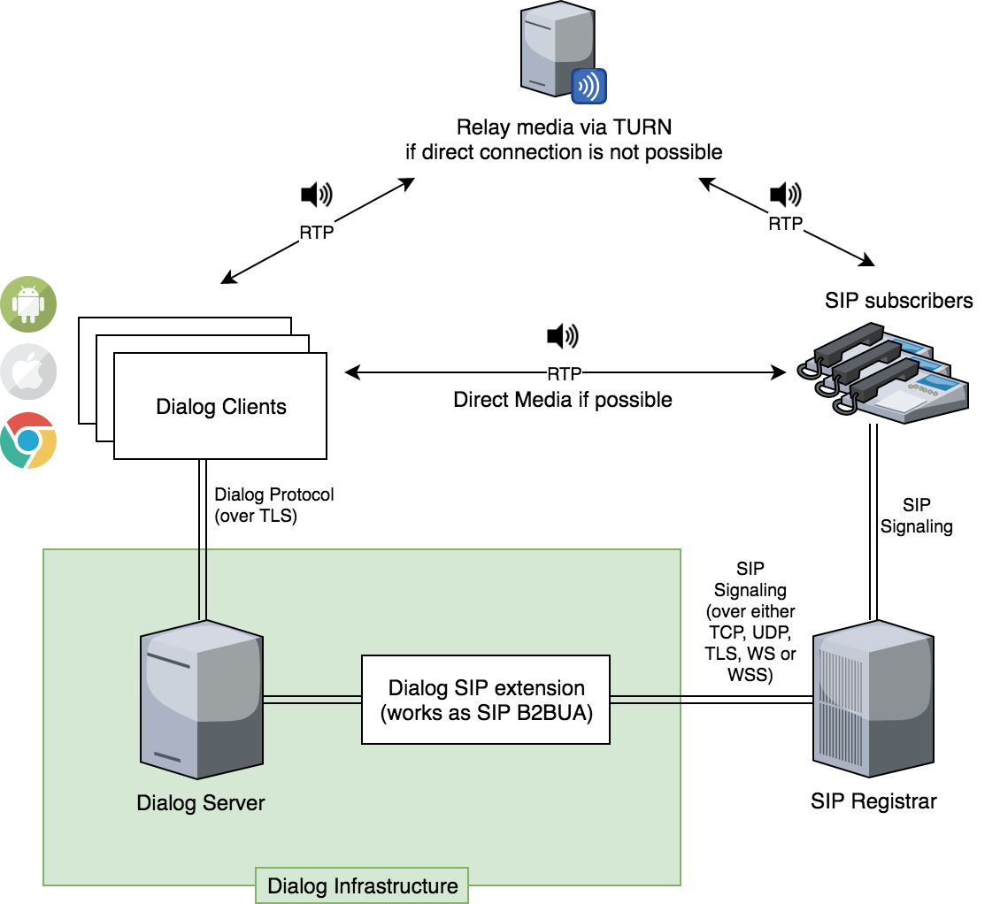

SIP High Level Architecture
===========================

As most of VoIP systems do, dialog decouples signaling (such as call
state messages, invite / answer information, etc) and media traffic (audio/video
streams). We use SIP signaling for external integrations, OPUS/PCMA/PCMU for
audio and VP8 for video.

If you want your clients to be able to call from different networks (basically
in every case if you want to call from internet), you will also need to setup
an ICE server (TURN).

SIP Signaling
-------------

Dialog SIP extension works as a back to back user agent (B2BUA), i.e. it
registers on a SIP server on behalf of the end user, translates and forwards SIP
commands to the dialog clients.

Dialog SIP extension supports SIP over following transports: TCP, UDP, SCTP,
TLS, WS (websocket), WSS (secure websockets).

If you're using TLS or WSS you will also need to setup a correct SSL certificate
on your SIP server.

Your SIP Registrar server should be is accessible from the Dialog Serer.

Media traffic
-------------

Dialog SIP extension does not perform any media transcodings and expects SIP
clients to understand clients media (which is WebRTC).

In case if you're using ICE servers, you should make them accessible for
external SIP clients (or from SIP PBX if it is in relay mode).

Security
--------

Media traffic between dialog clients and SIP clients secured by DTLS (in fact,
WebRTC enforces usage of DTLS for all media connections).

.. warning::

   Signaling traffic between dialog SIP Extension and SIP Registrar is secured
   only if you're using TLS / WSS.

   You may consider possibility of using unsecure protocols, such as TCP/UDP/WS
   if both SIP Registrar and dialog server are in private network secured
   by firewall.
