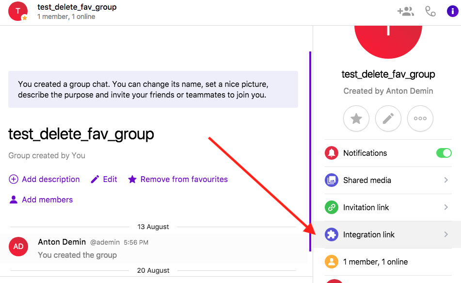
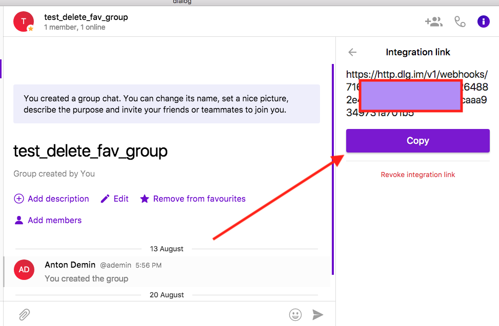
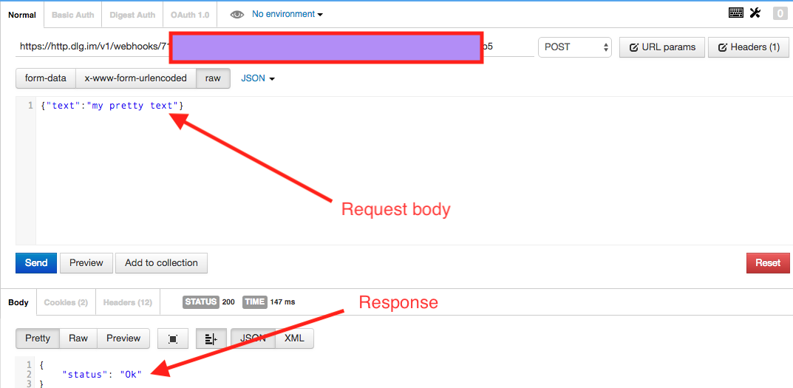
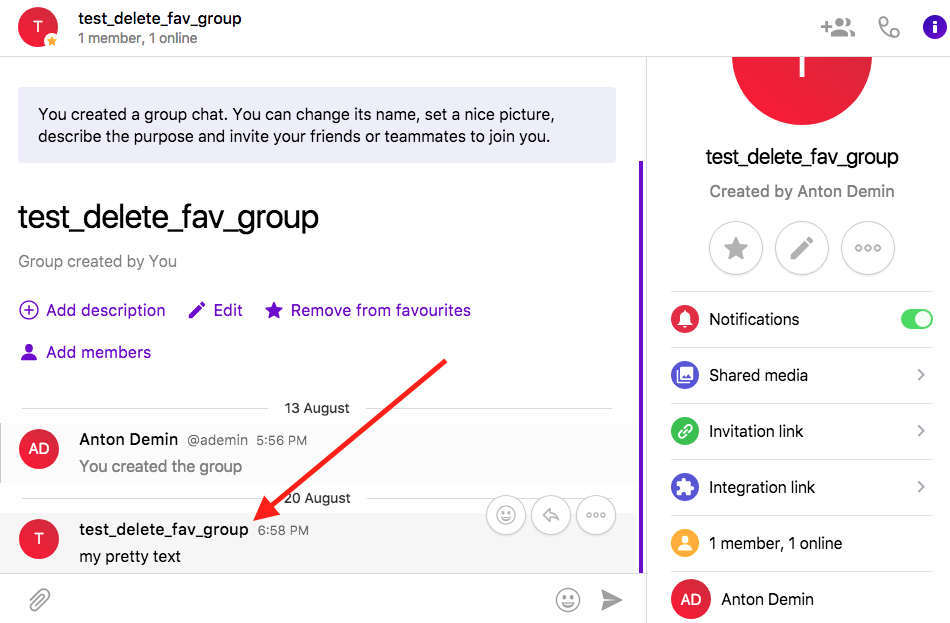

Group POST Hook
===============

Integration link is only accessible for groups or channels.
To obtain an integration link you should be a creator or owner of group.

1. First you have to obtain the integration link for your group by clicking right menu item

2. Copy the link

3. Execute POST request to the link with the body of following format:

.. code-block:: json

  {"text":"my pretty text"}

On success you'll get response: 

.. code-block:: json

  {
    "status": "Ok"
  }

4. Message will be posted to the group from its name:

