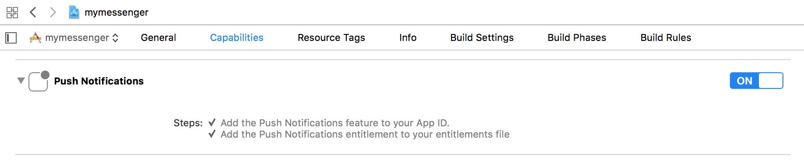

.. _common-application-settings-ios-label:

Common application settings
===========================

For the full operation of the dialog SDK, you need a number settings and of user permissions in Info.plist. Some settings are necessary to get a review in the App Store.

Custom URL scheme
-----------------

:ref:`invitation links <invitation-links-protocol-label>`

some text

Push Notifications and Background modes
---------------------------------------

some text

Permission usage descriptions
------------------------------

some text

Slyle
-----

some text
