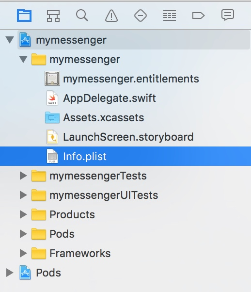

.. _common-application-settings-ios-label:

Common application settings
===========================

For the full operation of the dialog SDK, you need a number settings and of user permissions in **Info.plist**. It's the base configuration file of your iOS application:

Custom URL scheme
-----------------

Custom URL-scheme is necessary for correct work with the invitation links (see the section :ref:`Invitation links <invitation-links-protocol-label>` for more details). The application notifies iOS that it can handle links with a given schema. For example, if a user clicks on a link inside e-mail or web-site page like

.. code-block:: html

    mymessenger://mycompany.com/joinChat?shortname=coolChannel

he can immediately open a coolChannel chat in the messenger. To do this, you need to set the following values in **Info.plist**:

.. code-block:: xml

    <key>CFBundleURLTypes</key>
    <array>
      <dict>
        <key>CFBundleTypeRole</key>
        <string>Editor</string>
        <key>CFBundleURLName</key>
        <string>com.mycompany.mymessenger</string>
        <key>CFBundleURLSchemes</key>
        <array>
          <string>mymessenger</string>
        </array>
      </dict>
    </array>

Push Notifications and Background modes
---------------------------------------

dialog SDK supports high-quality calls and secure push notifications. To enable push notifications open **Capabilities** tab in target settings and turn the **Push Notifications** switch on:

.. image:: assets/common-application-settings/capabilities-push-notifications.jpg
   :width: 600 px
   :align: center

Pre-ensure that push notifications service and certificates are enabled for your **App ID** (see the section :ref:`Application services and certificates <application-services-and-certificates-ios-label>` for more details).

The correct operation of the SDK requires a number of enabled background modes:

.. code-block:: xml

    <key>UIBackgroundModes</key>
    <array>
      <string>audio</string>
      <string>remote-notification</string>
      <string>voip</string>
    </array>

Key ``audio`` allows you to talk via the messenger in background mode. ``remote-notification`` and ``voip``  are necessary to establish a connection for a call.  Key ``remote-notification`` is also required for secure push notifications.

Usage descriptions
------------------

Usage descriptions are necessary to pass a review in the App Store. These values show user why the app ask certain user permissions. dialog SDK requires permissions for camera, contacts, location, microphone and photo library:

.. code-block:: xml

    <key>NSCameraUsageDescription</key>
    <string>Camera let you to send photos to the chat directly.</string>
    <key>NSContactsUsageDescription</key>
    <string>We will process your data at our server to import your contacts automatically.</string>
    <key>NSLocationWhenInUseUsageDescription</key>
    <string>You will be able to share your location in a chat.</string>
    <key>NSMicrophoneUsageDescription</key>
    <string>Microphone is used for calls and voice messages.</string>
    <key>NSPhotoLibraryUsageDescription</key>
    <string>You will be able to send photos to the chat directly.</string>

Slyle
-----

sorry, the section is under construction
