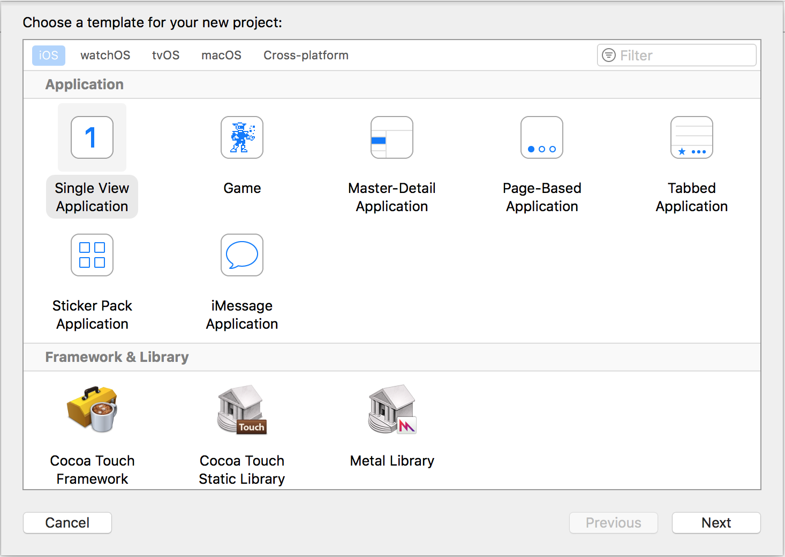
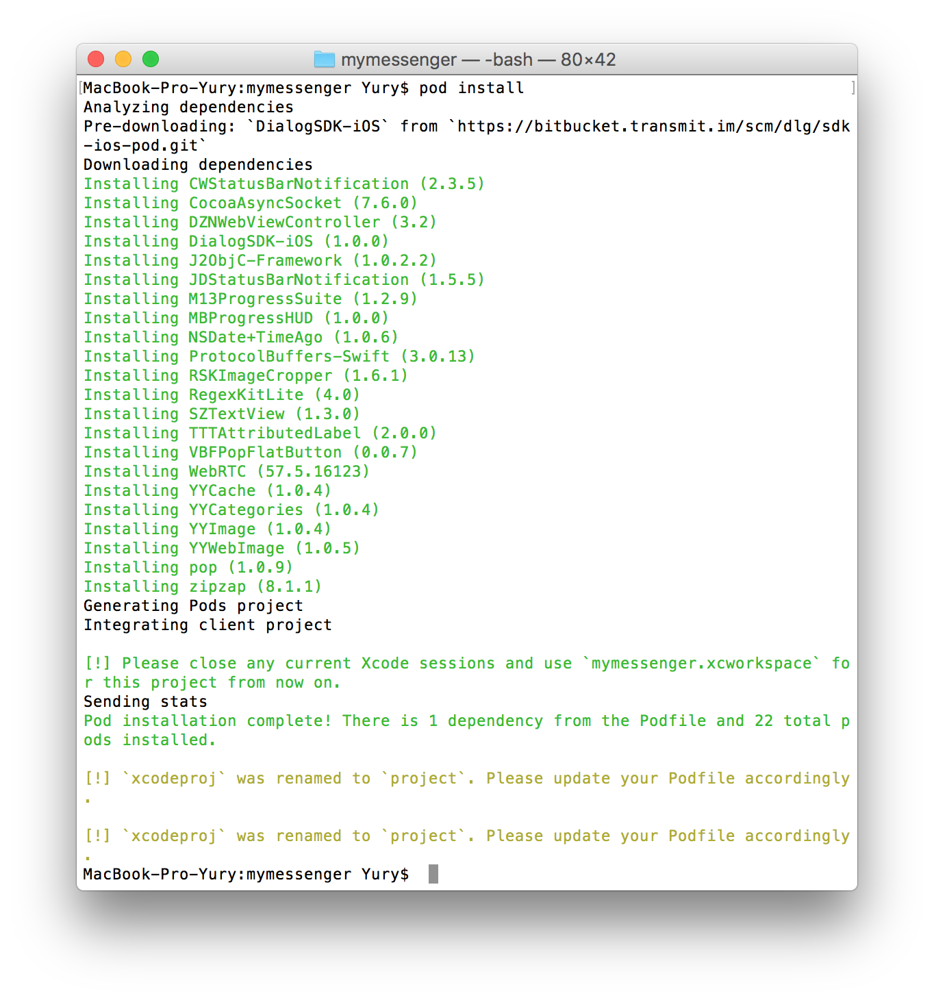

.. _quick-start-guide-ios-label:

Quick-start guide
=================


dialog SDK is shipped via CocoaPods, so getting your own messenger built and ready-to-go should only take half an hour! It is assumed that you have already enrolled into Apple Developer Program and have a **Bundle ID** of the future application.

Project configuration
---------------------


Open xCode and create a new project with **Single View Application** template:




**Bundle Identifier** is derived value of fields **Product Name** and **Organization Identifier**. At the same time the Bundle Identifier should be the same as specified in your account on the Apple Developer site (**Bundle ID**). You can change it later in the project setting. Your **Team** is also specified on the Apple Developer (you will need Developer Certificates and Provisioning Profiles). Select ``Swift`` as the programming language, the device type is ``Universal`` (select ``iPhone`` if you are not going to support iPad). **Use Core Data**, **Include Unit Test** and **Include UI Test** remain at your discretion.


Click Next, open **Build Settings**, and disable **Bitcode** (dialog SDK does not support it):


Close xCode and go to the CocoaPods setup.

CocoaPods setup
---------------------

Create **Podfile** in the project root (in the same directory as the **mymessenger.xcodeproj**):


Podfile is a plain text file containing the following values:

.. code-block:: xml

    platform :ios, '9.0'
    use_frameworks!

    workspace 'mymessenger'
    xcodeproj 'mymessenger.xcodeproj'

    target 'mymessenger' do

    pod 'DialogSDK-iOS' , :git => 'https://bitbucket.transmit.im/scm/dlg/sdk-ios-pod.git'
    xcodeproj 'mymessenger.xcodeproj'

    end

Open **Terminal** and run ``pod install``. The installation process can take a few minutes, depending on the speed of the Internet connection. Loading of the framework (``Pre-downloading: `DialogSDK-iOS```) takes most of the time.



The **mymessenger.xcworkspace** file should appear in the project directory. Double click on it, the xCode will open (it's important to open this file, not **mymessenger.xcodeproj**). Note: if you are using the Git version control system, it is recommended to add the following configuration to the **.gitignore** (otherwise you will get several gigabytes of dependencies in your Git-repository):

.. code-block:: xml

    # CocoaPod data
    Podfile.lock
    Pods/

It also makes sense to add the MyDialogApp.xcworkspace file to the exceptions list, because of it is generated automatically.
