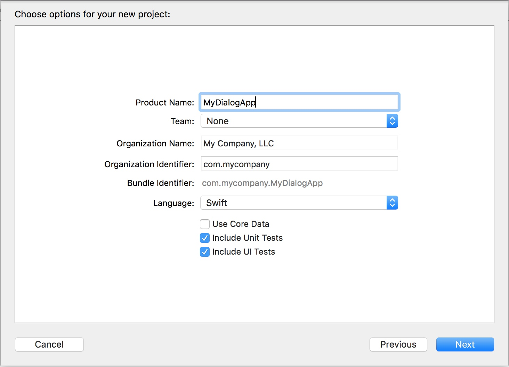

.. _quick-start-guide-ios-label:

Quick-start guide
=================


dialog SDK is shipped via CocoaPods, so getting your own messenger built and ready-to-go should only take half an hour! It is assumed that you have already enrolled into Apple Developer Program and have a **Bundle ID** of the future application.

Project configuration
---------------------


Open xCode and create a new project with **Single View Application** template:

.. image:: assets/quick-start-guide/xcode-single-view-application.jpg
   :width: 600 px
   :align: center


**Bundle Identifier** is derived value of fields **Product Name** and **Organization Identifier**. At the same time the Bundle Identifier should be the same as specified in your account on the Apple Developer site (**Bundle ID**). You can change it later in the project setting. Your **Team** is also specified on the Apple Developer (you will need Developer Certificates and Provisioning Profiles). Select ``Swift`` as the programming language, the device type is ``Universal`` (select ``iPhone`` if you are not going to support iPad). **Use Core Data**, **Include Unit Test** and **Include UI Test** remain at your discretion.




Click Next, open **Build Settings**, and disable **Bitcode** (dialog SDK does not support it):


Close xCode and go to the CocoaPods setup.

CocoaPods setup
---------------------

Create **Podfile** in the project root (in the same directory as the **mydialogapp.xcodeproj**):

.. image:: assets/quick-start-guide/podfile-location.jpg
   :width: 325 px
   :align: center


Podfile is a plain text file containing the following values:

.. code-block:: xml

    platform :ios, '10.0'
    use_frameworks!

    workspace 'MyDialogApp'
    project 'MyDialogApp.xcodeproj'

    def common_pods
        pod 'DialExt', :git => 'ssh://git@bitbucket.transmit.im:7999/dlg/dialext.git'
        pod 'DLGSodium', :git => 'https://github.com/dialogs/swift-sodium.git'
        pod 'ProtocolBuffers-Swift', '3.0.24'
        pod 'DiaLogSentry', :git => 'ssh://git@bitbucket.transmit.im:7999/dlg/dialogsentry.git'
        pod 'RxCocoa',    '~> 3.0'
    end

    target 'MyDialogApp' do

        pod 'DialogSDK-iOS' , :git => 'https://bitbucket.transmit.im/scm/dlg/sdk-ios-pod.git'
        pod 'DialogWebRTC', :git => 'https://bitbucket.transmit.im/scm/dlg/dialog-webrtc-ios-pod.git', :tag => '63.2.20237'
        pod 'FeltPen', :git => 'ssh://git@bitbucket.transmit.im:7999/dlg/feltpen.git'
        pod 'RxSwift',   :git => 'https://github.com/dialogs/RxSwift.git', :branch => 'fix/signatures'

        pod 'ClosePixelate'

        # React
        system "yarn install"
        pod 'React', :path => './node_modules/react-native', :subspecs => [
            'Core',
            'RCTText',
            'RCTImage',
            'RCTNetwork',
            'BatchedBridge',
            'RCTAnimation'
        ]
        pod 'Yoga', :path => './node_modules/react-native/ReactCommon/yoga'
        pod 'BVLinearGradient', :path => './node_modules/react-native-linear-gradient'

        common_pods

    end


    post_install do |installer|

        # Fix for
        # https://github.com/CocoaPods/CocoaPods/issues/7003
        copy_pods_resources_path = "Pods/Target Support Files/Pods-MyDialogApp/Pods-MyDialogApp-resources.sh"
        string_to_replace = '--compile "${BUILT_PRODUCTS_DIR}/${UNLOCALIZED_RESOURCES_FOLDER_PATH}"'
        assets_compile_with_app_icon_arguments = '--compile "${BUILT_PRODUCTS_DIR}/${UNLOCALIZED_RESOURCES_FOLDER_PATH}" --app-icon "${ASSETCATALOG_COMPILER_APPICON_NAME}" --output-partial-info-plist "${BUILD_DIR}/assetcatalog_generated_info.plist"'
        text = File.read(copy_pods_resources_path)
        new_contents = text.gsub(string_to_replace, assets_compile_with_app_icon_arguments)
        File.open(copy_pods_resources_path, "w") {|file| file.puts new_contents }


        installer.pods_project.targets.each do |target|
            if target.name == 'DialExt'
                target.build_configurations.each do |config|
                    config.build_settings['SWIFT_VERSION'] = '4.0'
                end
            end
        end
    end


Create **package.json** file in the project root. It contains the following values:

.. code-block:: json

    {
      "name": "MyReactNativeApp",
      "version": "0.0.0",
      "private": true,
      "scripts": {
        "start": "node node_modules/react-native/local-cli/cli.js start",
        "build": "node node_modules/react-native/local-cli/cli.js bundle --platform ios --dev false --entry-file coop-connect/js/index.js --bundle-output coop-connect/Resources/coop.jsbundle --assets-dest coop-connect/Resources/react-native",
        "postinstall": "sed -i '' 's\/#import <RCTAnimation\\/RCTValueAnimatedNode.h>\/#import \"RCTValueAnimatedNode.h\"\/' ./node_modules/react-native/Libraries/NativeAnimation/RCTNativeAnimatedNodesManager.h"
      },
      "dependencies": {
        "@dlghq/dialog-native-components": "0.7.8",
        "react": "16.0.0-alpha.12",
        "react-native": "0.47.1"
      }
    }

    
Open **Terminal** and run ``brew install node``. Wait until the installation is complete and than run ``npm install``.

Preparatory work completed, run ``pod install``. The installation process can take a few minutes, depending on the speed of the Internet connection. Loading of the framework (``Pre-downloading: `DialogSDK-iOS```) takes most of the time.

The **MyDialogApp.xcworkspace** file should appear in the project directory. Double click on it, the xCode will open (it's important to open this file, not **MyDialogApp.xcodeproj**). Note: if you are using the Git version control system, it is recommended to add the following configuration to the **.gitignore** (otherwise you will get several gigabytes of dependencies in your Git-repository):

.. code-block:: xml

    # CocoaPod data
    Podfile.lock
    Pods/

It also makes sense to add the **MyDialogApp.xcworkspace** file to the exceptions list, because of it is generated automatically.

App initializing
----------------

Open **General** tab in target settings and erase **Main Interface** field:

.. image:: assets/quick-start-guide/remove-main-interface.jpg
   :width: 600 px
   :align: center

Remove **ViewController.swift** and **Main.storyboard** files (choose "Move to Trash", in the removal dialog) and open **AppDelegate.swift**. Edit the file:

#. Import **DialogSDK** header.
#. Inherit **ApplicationDelegate** class from **DialogApplicationDelegate**.
#. Add **override** keyword to method **application:didFinishLaunchingWithOptions:**.
#. Specify server endpoints (you can use base dialog endpoints for testing).
#. Add **createDialog()** invocation (it launches base services of dialog SDK).
#. Add **presentMessengerInNewWindow()** invocation (it presents welcome view controller on the main window).

.. code-block:: swift

    //
    //  AppDelegate.swift
    //  MyDialogApp
    //
    //  Copyright © 2017 My Company, LLC. All rights reserved.
    //

    import UIKit
    import DialogSDK

    @UIApplicationMain
    class AppDelegate: DialogApplicationDelegate {

        var window: UIWindow?

        override func application(_ application:
            UIApplication, didFinishLaunchingWithOptions launchOptions:
            [UIApplicationLaunchOptionsKey: Any]?) -> Bool {

            DialogSDK.sharedDialog().endpoints =
                          ["tls://front1.dlg.im", "tls://front2.dlg.im"]
            DialogSDK.sharedDialog().createDialog()
            DialogSDK.sharedDialog().presentMessengerInNewWindow()

            return true
        }

    }

The project is ready to start! Build and Run. Press login button on the welcome screen, enter you phone number and press **Next**.


Confirmation code will be sent to you. Enter the code and press **Next**:

.. image:: assets/quick-start-guide/confirmation-code.jpg
   :width: 432 px
   :align: center

Your messenger is ready to go!
