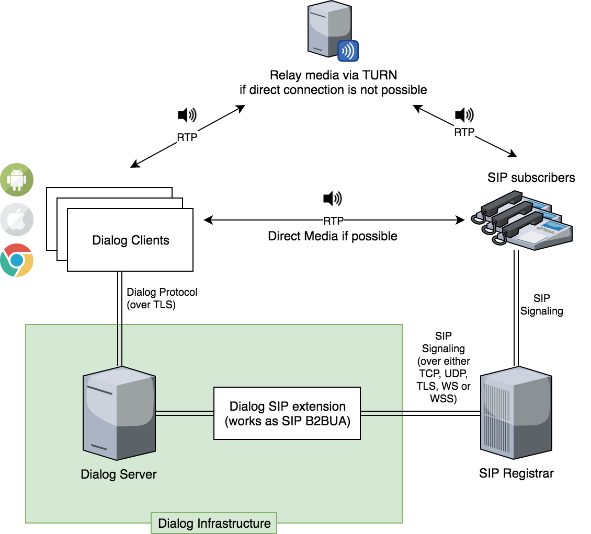

SIP Architecture
================

Dialog SIP extension works as a back to back user agent (B2BUA), i.e. it registers on a SIP server on behalf of the end user, translates and forwards SIP commands to the dialog clients.

Dialog SIP extension does not perform any media transcodings and expects SIP clients to understand clients media (which is WebRTC).

Prerequisites
-------------

The current version of the dialog SIP module assumes:

1. You have a SIP registrar server

The dialog SIP module cannot interact with other sip clients directly.

2. WebRTC must be configured as following:

  1. Audio codec is `OPUS <https://opus-codec.org/>`_ and video codec is `VP8 <https://en.wikipedia.org/wiki/VP8>`_

  2. ICE (Interactive Connectivity Establishment) is enabled to perform NAT traversal

  3. ``bundlePolicy`` = ``balanced``

  4. ``rtcpMuxPolicy`` = ``require``
