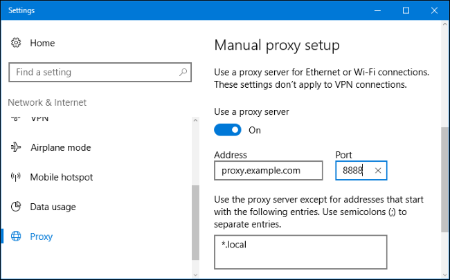
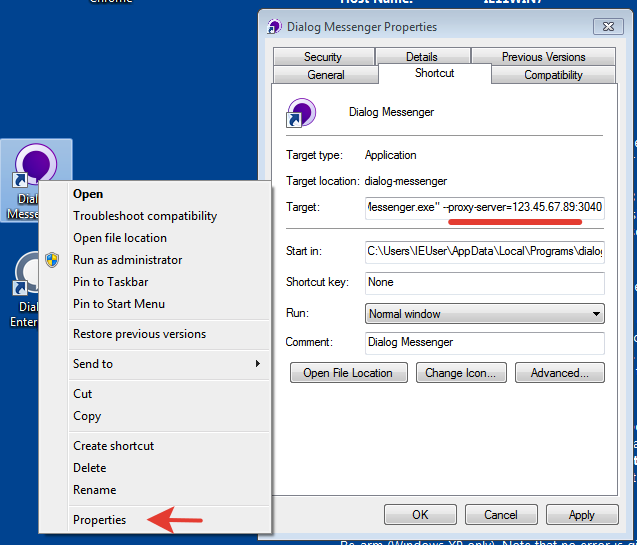

Proxy
=====

Dialog web apps supports proxy servers. 

Simple way
----------

Setup proxy server in your operation system settings.
Desktop application would use this settings automaticly.
Also you can use web application (https://app.dlg.im) in any of supported browsers.

.. note::

   If your proxy server requires authorization and you want to use desktop application,
   you should add username/password in OS proxy settings.
   
**Windows**
   
On Windows 10, you'll find these options under Settings > Network & Internet > Proxy. 
On Windows 8, the same screen is available at PC Settings > Network Proxy.

On Windows 7, you can change your proxy through the Internet Settings dialog.

First, open the Internet Options window.

You'll find it at Control Panel > Network and Internet > Internet Options. 
You can also click the Tools menu in Internet Explorer and select "Internet Options" to open it.

Click the "Connections" tab at the top of the Internet Options window. 
Click the "LAN Settings" button at the bottom of the window.

`Reference article <https://www.howtogeek.com/tips/how-to-set-your-proxy-settings-in-windows-8.1/>`_

Hard way
--------

You can configure desktop application using special flags.

Use a specified proxy server, which overrides the system setting.

.. code-block:: bash

    --proxy-server=<address>:<port>
    

Uses the PAC script at the specified url.

.. code-block:: bash

    --proxy-pac-url=<url>

Don't use a proxy server and always make direct connections. 
Overrides any other proxy server flags that are passed.

.. code-block:: bash

    --no-proxy-server
